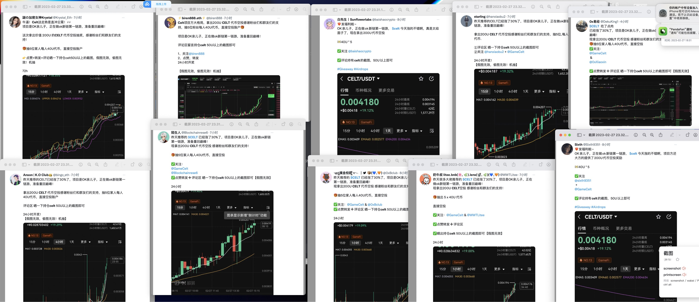

# 公众舆论事件

#### 23/2/28

CELT砸盘。OKX冻结获利账户、项目方退回130万USDT、OKX 捐助100万USDT、对受损用户空投。

1/平台将重新检查上币标准，以防止上线劣质代币，并考虑下架 [$CELT](https://twitter.com/search?q=%24CELT\&src=cashtag\_click) 。&#x20;

2/作为一家中立的交易所，除 [$OKB](https://twitter.com/search?q=%24OKB\&src=cashtag\_click) [$OKT](https://twitter.com/search?q=%24OKT\&src=cashtag\_click) 以外，任何项目不得利用与OKX的合作关系进行推广。



里探评论：收买人心、安抚客户、展现格局。“OKX坚持打造更好的品牌，更好的产品”。

#### 23/2/27

celt项目方找kol喊单，然后出现暴跌砸盘。

里探评论：一个项目大肆宣传之时，你就必须离场。因为一定要到顶了。

<figure><figcaption></figcaption></figure>

#### 2022/11/11

**FTX破产危机**

事件\
**负债披露**\
****11月2号Coindesk发表的一篇报道，对FTX的资产负债提出质疑。\
11月6号币安CEO赵长鹏（CZ）发布推特：决定“逐步清空”自持的约5亿美元的FTT。\
Alameda CEO Caroline表示愿意以22美元的价格回购币安所持有的全部FTT，但遭到CZ的拒绝。\
**挤兑开始**\
****11月7，FTT快速下跌，由22$最低跌至$3，总市值缩水近90%。用户开始从FTX大量提取加密资产和法币资金。\
btc从21k跌回19K\
**收购消息**\
****11月9，CZ和SBF各自发表声明，表示币安正在对FTX进行尽职调查，将可能收购FTX。\
btc从19k拉回近20.6K后， 立马调转方向从20.6K跌至17.2K\
**放弃收购**\
****11月10，币安根据尽职调查结果决定放弃收购FTX\
btc最低跌至15.5K\
**寻求援助**\
****FTX寻求筹集超过90亿美元的资金，以填补财务缺口。\
**走向破产**\
****11月11，FTX在美国发布申请破产申明 \
FTX：已在美国开始执行破产程序\
**后续影响**\
****币安首席执行官赵长鹏：加密交易所FTX崩溃的全面影响尚未显现。\
币安首席执行官赵长鹏：加密危机可能会产生连锁反应。\
\
里探评说：\
**庄家、试图做庄的、操纵市场的聪明人，这些都是市场猎人的猎手对象，目标大且肉肥。 一旦被发现弱点，很容易被狙击。**\
不要试图做市场中的聪明人，可以傻稳呆，只是观察，减少动脑，根据观察到的大量客观事实 用直觉和本能做判断。\
\
收购消息是利好，市场瞬间上涨。但收购消息意味着 【资不抵债的确定性】和【收购失败的风险】，暴跌的概率就很高。\
**消息有两面性，不能只看到表面的利好，要看到背后反映的事实，以及事实会带来的影响。**这里只看到利好，是目光短浅。\
\
市场思考：ftx的问题会引发市场对cex的巨大担忧？bn ok hb cb风险相应增大？dex有很大市场潜力？
