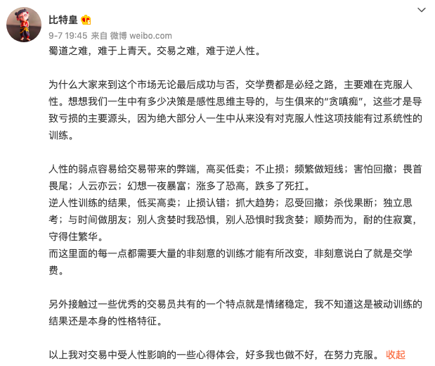

# Trader、KOL语录

本文记录币圈一些较知名、活跃的KOL、Trader关于投资的看法。以供参考学习。

####

#### 23/3/2&#x20;

[oneone.eth](https://twitter.com/MayGordon01)

去大v化。大V不一定懂。

做自己擅长的部分。扬长避短。

有自己的稳定信息流。不要听大V喊单。

经常性复盘。总结经验教训才能提升。

形成自己的闭环逻辑。自己有一套才行。&#x20;

#### 2023年2月

[𝐁𝐢𝐭𝐰𝐮.𝐞𝐭𝐡](https://twitter.com/BTW0205)

不要羡慕滚仓复利：你必须要在控制风险基础上追求暴利，而不是在暴利的基础上控制风险。 投资的第一要诀：控制风险，永远保证自己在牌桌上！正确认识自己，慢即是快！

[Crypto熊猫](https://twitter.com/NoodleofBinance)：\
现在的行情拼的已经不是谁币选的好，谁点位好。\
普涨无脑行情里拼胆量、拼赌性、拼谁的仓位大、拼谁的杠杆高。


里探评说：确定性机会、胆量赌性、控制风险需要达到一个平衡。


[庞教主](https://twitter.com/kiki520\_eth) 2023年2月6日

对散户的建议：

及早构建自己的投资体系，就是少亏钱的体系，任何不能持续性的竹篮打水式的投资毫无意义

构建体系难吗？不难，我认识的一位K线交易员，只做一种形态，只做自己懂的一招，一招即可在投资市场长期获利

同时也难，难在外部的诱惑、内心的煎熬


里探评说：构建投资体系，实现长期稳定盈利。一招鲜吃遍天。


[Dp大鹏](https://twitter.com/Dp520888) 2023年2月5日\
高位追热门小山寨币亏钱的速度可比做合约还快，如果你的交易逻辑里没有在比特币在左侧回调通道的时候追涨热门右侧拉升的小山寨币可千万不要轻易尝试


里探评说：自己的投资活动，一定要和自己的投资逻辑是匹配的。


【币圈韭菜的十大特征】

1、听小道消息炒币。

2、频繁交易、追涨杀跌、乐在其中。

3、开合约不设不止损。

4、永远满仓。

5、看别人赚钱焦虑。

6、把运气当作实力，觉得自己是天才交易员。

7、人傻，胆大，钱多。

8、只认识代币，不去调研。

9、随便相信群友。

10、牛市高点进场。


里探评说：韭菜受消息、情绪控制，盲目投资。缺思路、方法、逻辑、策略、理念。


[王大有](https://twitter.com/youyou5202) 2023年1月27日

坚持一个观点：毕其攻于一役是个中性词

财富的增长未必是线性均匀的，可能是跳跃性的

在关键机会出现的时间点，想清楚最后可能和应对方式后，大胆猛干也留一定后路，不论是实盘还是我的日常都贯彻这个原则。


里探评说：确定性机会下重仓，一波流的投资理念。


[期货老司机](https://weibo.com/1353879573?refer\_flag=1001030103\_)  2023年2月8日

赚了钱后，很多人会把一刻当永久，把爆发性收入当成持续性收入，运气褪去大概率会被毒打；

财富最终是你认知维度与能力的映射。

不过风控的核心是你能赚钱，利润越肥你的安全垫越厚，在这基础上才能讲风控。

没有积累时，还是要看赔率和梭哈。&#x20;

顺序不能颠倒，没积累时猥琐，赚了钱还继续梭哈，就傻逼了。


里探评说：不同的资金，对应不同的策略。财富要和认知匹配。


[𝐁𝐢𝐭𝐰𝐮.𝐞𝐭𝐡](https://twitter.com/BTW0205)\
\
任何不能给总资本带来实实在在的收益率都是自我脑嗨！ \
每天跟着所谓热点币跑，没有底层逻辑，根本不敢重仓，所谓的赚钱都是小钱，都是运气，都是颅内高潮！\
所以赚钱的本质是：你敢重仓哪个币？而不是你投资了哪个币\
\
在 [#Crypto](https://twitter.com/hashtag/Crypto?src=hashtag\_click) 中赚钱， 50% 是及早发现叙事， 40% 是获利落袋为安， 10% 是避开暴跌。


里探评说：仓位很重要，敢重仓才能赚大钱。


[比特皇回来了](https://weibo.com/u/7617079861)

<figure><figcaption></figcaption></figure>

低买高卖；止损认错；抓大趋势；忍受回撤；杀伐果断；独立思考。\
与时间做朋友；别人贪婪时我恐惧，别人恐惧时我贪婪；\
顺势而为，耐的住寂寞，守得住繁华。\
\
首先观察大势，感觉行情有可能出现一波30%以上波动的机会的时候，耐心等待，只要是有可能出现转折的地方都先开进去。\
如果行情符合预期，就一直拿着，找合适的机会加仓（加仓时机是个技术活）\
如果行情没有按预期走，就止损 对冲或者止盈出局，等待下一次机会。\
\
小资金做大\
\
拿能亏得起的钱，耐心等待盈亏比最大的机会，最少1:10 以上。\
直接开个四十倍五十倍进去，爆仓止损。错了等下一次。\
做对了就盈利加仓，只要能抓住一波行情，本金最少能翻十几二十倍。 \
而不是频繁撸短线，这样只会让你的格局越来越小，眼里只能看到几个点的波动。\
遇到大的行情，要敢于重仓操作，因为大行情可遇不可求，只要抓住一波你的资金体量可能就会提高一个级别。\
\
\
大资金降低杠杆\
十几万，然后杠杆就逐渐降了下来，资金在几十万的时候一般不超过10倍。\
做到两三百万的时候，杠杆一般不会超过五倍。\
目前的资金量我可能一般行情也就开个三倍左右。（主要指BTC）\
\
\
2021/9/7\
蜀道之难，难于上青天。交易之难，难于逆人性。\
\
为什么大家来到这个市场无论最后成功与否，交学费都是必经之路，主要难在克服人性。想想我们一生中有多少决策是感性思维主导的，与生俱来的“贪嗔痴”，这些才是导致亏损的主要源头，因为绝大部分人一生中从来没有对克服人性这项技能有过系统性的训练。\
\
人性的弱点容易给交易带来的弊端，高买低卖；不止损；频繁做短线；害怕回撤；畏首畏尾；人云亦云；幻想一夜暴富；涨多了恐高，跌多了死扛。\
逆人性训练的结果，低买高卖；止损认错；抓大趋势；忍受回撤；杀伐果断；独立思考；与时间做朋友；别人贪婪时我恐惧，别人恐惧时我贪婪；顺势而为，耐的住寂寞，守得住繁华。\
而这里面的每一点都需要大量的非刻意的训练才能有所改变，非刻意说白了就是交学费。\
\
另外接触过一些优秀的交易员共有的一个特点就是情绪稳定，我不知道这是被动训练的结果还是本身的性格特征。\
\
以上我对交易中受人性影响的一些心得体会，好多我也做不好，在努力克服。\


里探评说：小资金做大的交易策略。交易中情绪的控制，人性的克服。


[午饭投资](https://weibo.com/u/2867319202)

国内对于价值投资的理解

比如有人认为就是长期投资

这不仅不准确这个长期也不对

有人甚至认为三年五年就是价值投资

如果还能更久一点主要是他被套牢了

而巴菲特和芒格对于价值投资的理解是

1、这家公司的护城河足够安全，这家公司的业务至少能存续几十年，一家你给出20倍以上pe的公司，至少要能保证业绩稳定还能增长存续20年以上，所以很多新公司没有经过时间证明的，一般都很难入他们的股票池。在国内一开始大家按照这个标准基本上只能找出茅台、马应龙这类属于符合巴菲特价值逻辑的。而像海天，格力，万科，甚至伊利虽然市场占有率也不算低，分红也不算差，但是护城河不够深，因为你很难确保30年后这些公司还在，而且业绩还是如此稳定。

2、巴菲特更倾向于买了之后，不用考虑什么时候再卖出的企业，而大多数伪价值投资者买了之后就在想什么时候卖，什么价格卖，真正的价值投资取向，相当于你和一个人结婚，好的结婚对象当然不是结完婚就想着什么时候离婚，而是想着自己能怎么活的更久，让幸福的婚姻延续的更久，生儿育女白首偕老，只有约的野泡，得手了你才会想赶紧跑

3、既然是价值投资，没有考虑短期卖出，那么长周期下的波动风险，比如加了杠杆的，借了钱炒股的，这些百分之一以下的概率，都要想办法规避，如果你想着今天买了啥时候都可能跑，一般就会把杠杆等风险忽略掉。

4、即使挑出来好公司，没借钱，没加杠杆，巴菲特也不一定马上就买，安全边际也是很重要的参考因素，他一般就是关注一堆好公司，然后拿着钱等这些公司出黑天鹅，或者等市场出黑天鹅给一个极其诱惑的价格来买入，这点其实是所有这些条件里最难得，首选做私募公募的投行经理，他们很难拿着客户的钱等，而即使你拿着自己的钱也无时无刻不想着梭哈，我自己的感受就是拿着钱等不知道何时才会出现的黑天鹅，对大多数人来说，比满仓套牢还要痛苦。

综上：好公司+好价格+无杠杆+耐心等待 是巴菲特价值投资的简单公式，缺一不可。我一度都是觉得20%的现金比例已经算是极高的比例了，经过几轮牛市后，我现在意识到在巴菲特的价值投资方式下，20%的现金比例是任何时候都应该有的最低比例。


里探评说：价值投资。


#### [大西哈](https://weibo.com/u/6074739022)

1、大方向操作。\
确定大方向，逐步建仓，要有仓位管理。\
方向错了，就割肉。\
方向对了，要能拿得住。不要随意平仓。\
2、及时套现，不要把本都亏进去。


里探评说：趋势。止损。获利。


